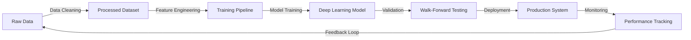

<div align="center">

<!-- Animated Header -->


<!-- Typing SVG -->
<a href="https://git.io/typing-svg"></a>

<br/>

[]()
[]()
[]()
[]()

</div>

---

## 🎯 About Me

I'm a **Multidisciplinary AI Engineer** specializing in high-stakes environments where models need to actually work—not just achieve benchmark scores. My expertise bridges two critical domains:

🏥 **Medical AI & Computer Vision**  
🔬 Pathology detection from imaging data  
🧬 Deep learning for diagnostic systems  
📊 Handling class imbalance in healthcare datasets

📈 **Quantitative Finance**  
💹 Algorithmic trading strategy development  
📉 Walk-forward analysis & backtesting  
⚡ Risk modeling & portfolio optimization

## 💻 Tech Stack & Expertise

<details open>
<summary><b>🔥 Deep Learning & Computer Vision</b></summary>
<br>

- **Frameworks:** TensorFlow, PyTorch, Keras
- **Computer Vision:** OpenCV, YOLO, Detectron2
- **Medical Imaging:** DICOM processing, 3D imaging, segmentation
- **Model Optimization:** Quantization, pruning, ONNX deployment

</details>

<details open>
<summary><b>📊 Quantitative Finance & Data Science</b></summary>
<br>

- **Trading Systems:** Backtesting frameworks, walk-forward analysis
- **Time Series:** ARIMA, LSTM, Transformer models
- **Risk Analytics:** VaR, Sharpe ratio optimization, Monte Carlo simulation
- **Data Processing:** Pandas, NumPy, Polars, DuckDB

</details>

<details open>
<summary><b>🛠️ MLOps & Engineering</b></summary>
<br>

- **Pipeline Engineering:** Airflow, Prefect, custom ETL
- **Deployment:** Docker, FastAPI, AWS/GCP
- **Monitoring:** MLflow, Weights & Biases
- **Version Control:** Git, DVC for data versioning

</details>

## 🚀 What Makes Me Different

```python
class AIEngineer:
    def __init__(self):
        self.mindset = "Production-first, not research-first"
        self.specialty = "Making AI work with messy, real-world data"
    
    def solve(self, problem):
        # Most engineers start here ❌
        # model = download_pretrained_model()
        
        # I start here ✅
        data = self.clean_messy_data(problem.raw_data)
        synthetic_data = self.generate_augmentations(data)
        pipeline = self.build_robust_pipeline(data)
        
        model = self.train_production_ready_model(pipeline)
        return self.deploy_with_monitoring(model)
```

**🎯 Core Philosophy:**
- 🧹 **Data Quality > Model Complexity** — Clean data beats fancy algorithms
- 🔄 **End-to-End Thinking** — From raw data ingestion to model serving
- 🎲 **Synthetic Data Mastery** — Generate training data when it's scarce
- ⚡ **Robustness First** — Models that work on Monday morning, not just in notebooks

## 📈 Current Focus



🔬 **Active Projects:**
- Building medical imaging pipelines for pathology detection
- Developing quantitative trading strategies with reinforcement learning
- Creating synthetic data generators for rare medical conditions
- Optimizing high-frequency trading models with low-latency inference

## 🌟 Key Competencies

| Domain | Skills |
|--------|--------|
| **🏥 Medical AI** | Pathology detection, medical image segmentation, DICOM processing, FDA-compliant workflows |
| **📈 Quant Finance** | Algorithmic trading, walk-forward analysis, backtesting, risk management, alpha generation |
| **🔧 Data Engineering** | ETL pipelines, data cleaning, synthetic data generation, feature stores |
| **🚀 Production ML** | Model deployment, monitoring, A/B testing, CI/CD for ML, model versioning |

## 💡 Problem-Solving Approach

I excel at projects where:
- ❌ The data is messy, incomplete, or poorly structured
- ⚡ Real-time performance and low latency matter
- 🎯 Precision is critical (healthcare, finance)
- 🔄 The problem requires end-to-end pipeline thinking
- 🎲 Training data is scarce and needs augmentation

## 📫 Let's Build Something

Working on challenging AI problems in healthcare or finance? Let's collaborate.

---

<div align="center">

**💭 "The difference between a data scientist and an AI engineer?**  
**One builds models. The other builds systems that use models to solve real problems."**

[]()
[]()

</div>
