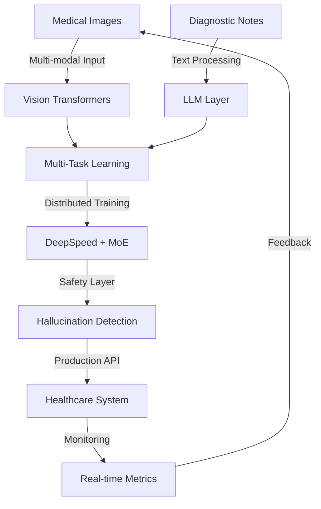

<div align="center">

<!-- Animated Header -->


<!-- Typing SVG -->
<a href="https://git.io/typing-svg"></a>

<br/>

[]()
[]()
[]()
[]()
[]()

</div>

---

## 🎯 About Me

**Machine Learning & Computer Vision Engineer** building real-world AI systems across medical imaging, distributed training, and VLM/LLM/RAG productization. Currently leading multi-modal AI research and commercialization efforts in healthcare and decision-support systems.

🏥 **Healthcare AI**  
🔬 Multi-modal medical imaging (OPG, Intraoral)  
🧬 Diagnostic systems with contextual notes integration  
🩺 LLM safety & hallucination mitigation in healthcare

⚡ **Distributed Systems & LLMs**  
🚀 Scaling deep learning with DeepSpeed, MoE, multi-node training  
🤖 VLM/LLM productization & RAG pipelines  
📊 Vision Transformers & Diffusion Models

## 💻 Tech Stack & Expertise

<details open>
<summary><b>🤖 AI / ML</b></summary>
<br>

- **LLMs & VLMs:** RAG, Transformers, Vision Transformers (ViT, Swin), Diffusion Models
- **Advanced Techniques:** Multi-Task Learning, Mixture of Experts (MoE), Transfer Learning
- **Training Methods:** Self-Supervision, Weak Supervision, Attention Mechanisms
- **Model Safety:** LLM hallucination mitigation, reasoning integrity in healthcare

</details>

<details open>
<summary><b>👁️ Computer Vision</b></summary>
<br>

- **Medical Imaging:** OPG, Intraoral imaging, diagnostic systems
- **Architectures:** Swin-UNet, ResNet, Vision Transformers, Attention Mechanisms
- **Tasks:** Segmentation, Classification, Object Detection, Visual Embeddings
- **Multi-modal:** Integrating imaging with contextual diagnostic notes

</details>

<details open>
<summary><b>⚡ Data Engineering & Distributed Systems</b></summary>
<br>

- **Distributed Training:** DeepSpeed, torchrun, ZeRO optimization, multi-node training
- **Data Pipelines:** ETL, Web Scraping (BeautifulSoup, Selenium), Feature Engineering
- **MLOps Tools:** DVC, Airflow, model versioning, experiment tracking
- **Scaling:** Large-scale model training, distributed inference

</details>

<details open>
<summary><b>🛠️ Software & DevOps</b></summary>
<br>

- **Backend:** Python, FastAPI, Flask, Node.js, JavaScript
- **Frontend:** React
- **Database:** MongoDB
- **DevOps:** Docker, GitHub Actions, CI/CD pipelines
- **Cloud:** AWS (EC2, S3), cloud infrastructure management

</details>

## 🚀 Current Focus

🔬 **Leading a multi-modal AI system** for medical diagnostics integrating different medical image modalities and contextual diagnostic notes

🛡️ **Researching LLM safety**, hallucination mitigation, and reasoning integrity in healthcare AI

⚡ **Scaling distributed deep learning systems** with DeepSpeed, MoE, and multi-node training

## 💡 Problem-Solving Approach

```python
class MLEngineer:
    def __init__(self):
        self.focus = "Real-world AI systems, not just papers"
        self.specialty = "Healthcare + Distributed Systems + LLM Productization"
    
    def build_system(self, problem):
        # Research → Production pipeline
        data = self.prepare_multimodal_data(problem)
        
        # Scale with distributed training
        model = self.train_with_deepspeed(
            data=data,
            architecture="VisionTransformer",
            strategy="MoE + ZeRO"
        )
        
        # Production-ready deployment
        system = self.productize_with_safety(
            model=model,
            guardrails="hallucination_detection",
            monitoring="real_time_healthcare_metrics"
        )
        
        return system.deploy()
```

**🎯 Core Strengths:**
- 🏥 **Healthcare AI** — Medical imaging systems that meet clinical standards
- ⚡ **Distributed Training** — Scaling models across multiple nodes efficiently
- 🤖 **LLM/VLM Systems** — RAG pipelines and vision-language models in production
- 🔒 **AI Safety** — Mitigating hallucinations and ensuring reasoning integrity

## 🌟 Key Competencies

| Domain | Skills |
|--------|--------|
| **🏥 Healthcare AI** | Multi-modal medical imaging (OPG, Intraoral), diagnostic systems, clinical-grade AI, contextual integration |
| **🤖 LLM/VLM Systems** | RAG pipelines, Vision Transformers, hallucination mitigation, VLM productization, reasoning integrity |
| **⚡ Distributed Systems** | DeepSpeed, MoE, ZeRO optimization, multi-node training, torchrun, large-scale model deployment |
| **🔧 Data Engineering** | ETL pipelines, web scraping, feature engineering, DVC, Airflow, multi-modal data processing |
| **🚀 Production ML** | FastAPI, Docker, CI/CD, AWS infrastructure, model deployment, safety guardrails |

## 📊 System Architecture



## 📫 Let's Connect

Building innovative AI systems in healthcare or distributed ML? Let's collaborate.

[](https://linkedin.com/in/hamza-jasim-521645190)
[](https://github.com/HJ701)
[](mailto:hamzah.al-omairi@mbzuai.ac.ae)

---

<div align="center">

**💭 "Real-world AI systems require more than good models—**  
**they require robust engineering, safety guardrails, and production excellence."**


</div>
